# Tornado Game

Live link: https://python-hangman1.herokuapp.com/

## Overview

As the game is played in the terminal/CLI I decided the target audience would be technology/computer enthusiasts 
(as they will have to have at least some knowledge of this to play the game in the first place) who enjoy guessing games, and computer games in general. The game itself is based on the game Hangman, but I came up with an alternative theme/imagery to give the game extra appeal to the target audience.

## Table of Contents

1. [Goals](#goals)
    1. [Organisation Aims](#organisation-aims)
    2. [User Stories](#user-stories)
2. [Game Development](#game-development)
    1. [Game Planning](#game-planning)
3. [Functionality](#functionality)
4. [Testing](#testing)
    1. [Validator Testing](#validator-testing)
    2. [Function Testing](#function-testing)
5. [Fixes](#fixes)
6. [Outstanding Bugs](#outstanding-bugs)
7. [Libraries](#libraries)
8. [Future Development](#future-development)
9. [Deployment](#deployment)
10. [Credits](#credits)
11. [Media](#media)

## Goals

### Organisation Aims

-   Create a variation on the traditional hangman game using a different theme & imagery
-   Make the the game easy to play and rules unambiguous
-   Allow the user to chose the difficulty of the words used in the game

### User Stories

- I want the game to be intuitive to understand and play
- I want to be able to continue playing or finish the game when I choose
- I want the game to be visually appealing
- I want to know the word after losing
- I want to be able to choose the difficulty of the game

## Game Development

My overall plan for the game was to create a hangman type game with it's own style. Due to the nature of it being played in the terminal this made me think about using a retro, arcade type of aesthetic for the game (to meet the first organisation aim & 3rd user story). I searched for ASCII art and came up with the idea of using a tornado approaching a house, getting closer every time the user guesses incorrectly. Implementing all this would enable the game to meet all user stories.

### Game Planning

Due to the nature of the game being command line the first step in the planning phase wasn't to wireframe but rather to create a flow chart that would enable me to implement the logic for the game into my python code and take it from there. The flow chart below was my starting point on which I expanded with further functions and the Tornado class.

## Functionality

The 'home' page for the game features a retro computer style font displaying the name of the game, then the rules for the game are displayed. The rules make use of a typing effect so that they appear to be typed out to the user (adding to the retro game aesthetic). These are followed by the question asking the user which difficulty they would like to play. These 3 features meet all 3 of the organisation aims and the 1st, 2nd, 3rd & 5th user stories.

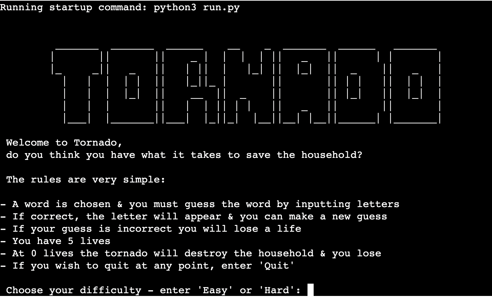

Once the game starts the user sees the main display for the game which is the tornado at it's furthest point from the house, the empty reveal word, the amount of remaining guesses which is then followed by the input which makes use of the typing effect to prompt the user to guess a letter or word. This meets the 1st and 3rd user stories.

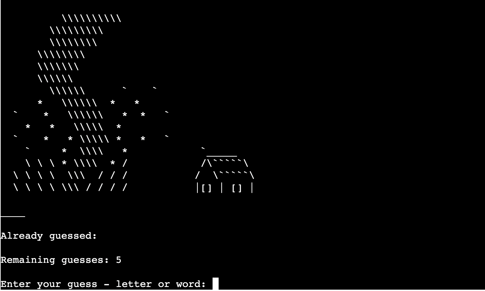

The game will then display relevant feedback to the user depending on their guess, as follows:

Correct letter:

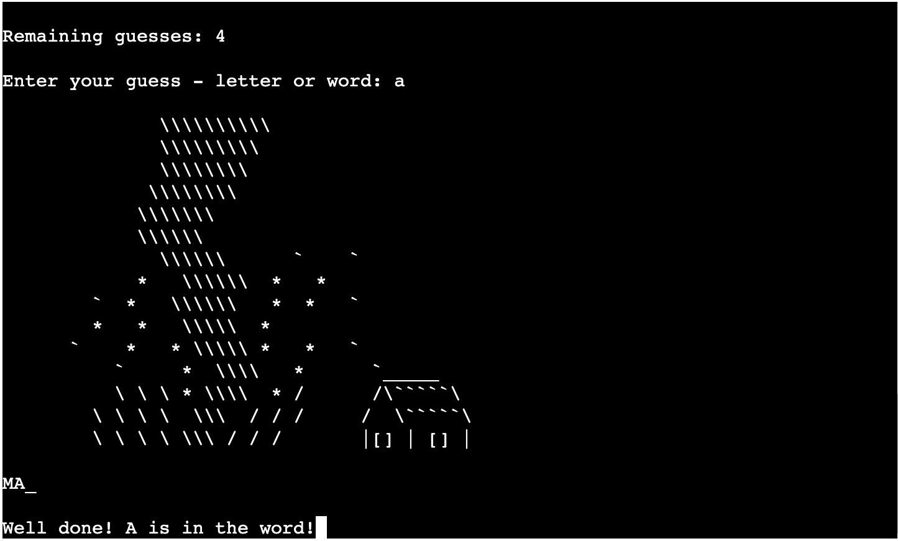

Incorrect letter:

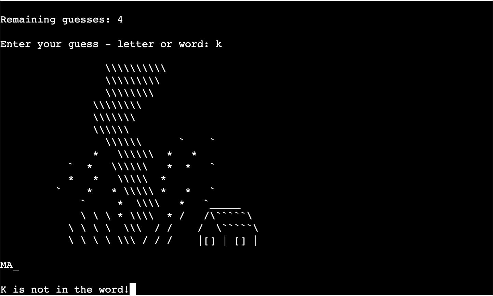

Invalid input:

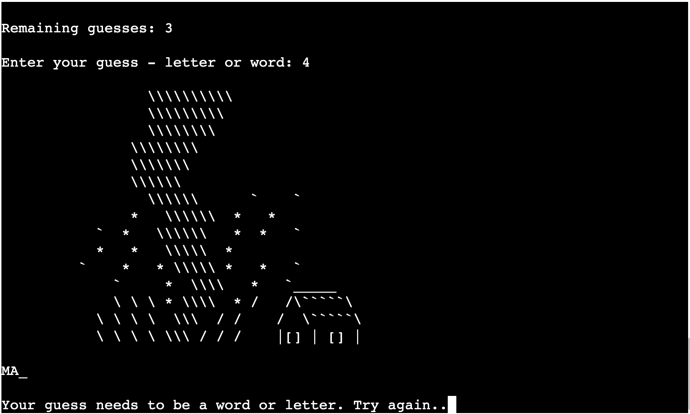

Incorrect word:

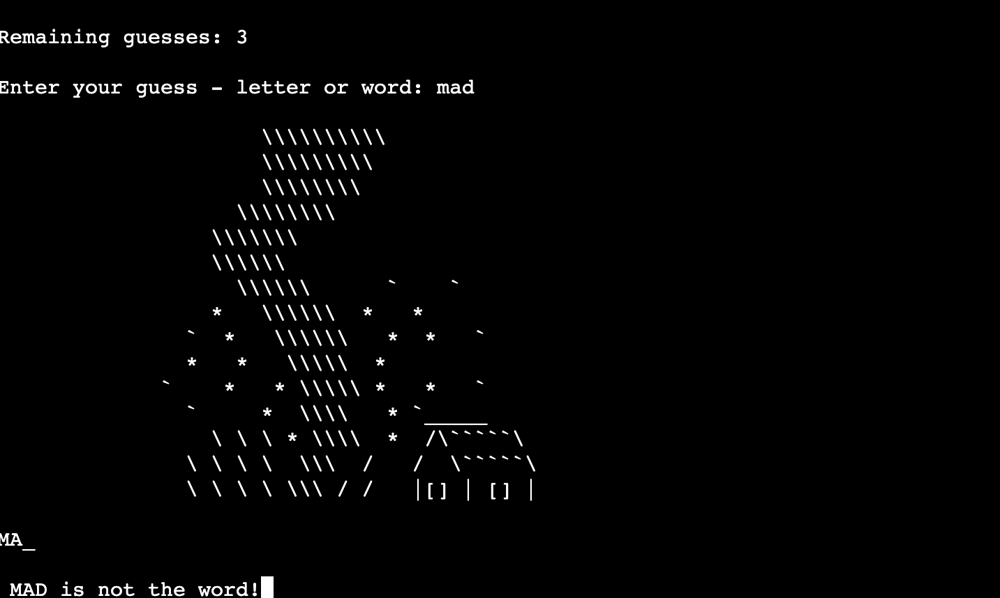

These features meet the first user story.

The game will then result in either win or lose game, at which point the user is informed what the correct word was if
they lost which is followed by asking if the user wants to play again - if they choose yes they are taken to the choose difficulty page and if they choose no they are displayed the quit game page. These meet the 2nd, 3rd, 4th & 5th user stories.

Win game:

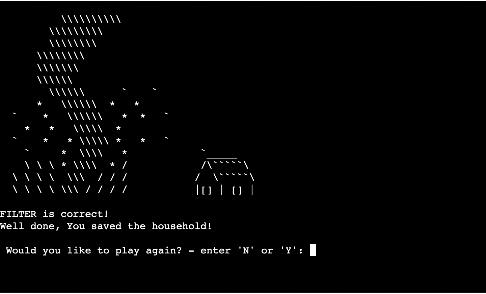

Lose game:

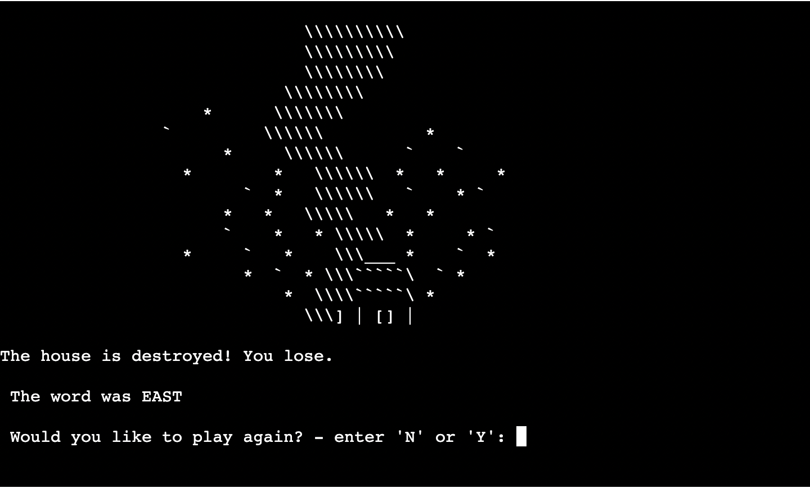

Play again:

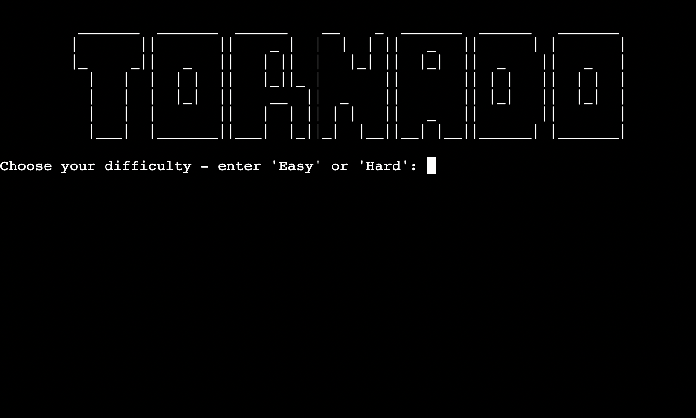

Quit game:

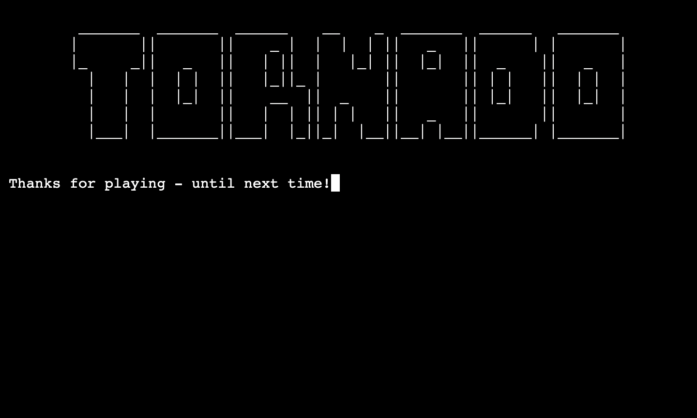

## Testing

### Validator Testing

The game makes use of three separate files, run.py, slides.py and words.py. The run.py and words.py files both pass without any errors or warnings.

run:

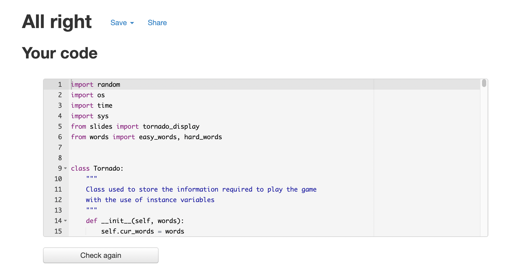

words:

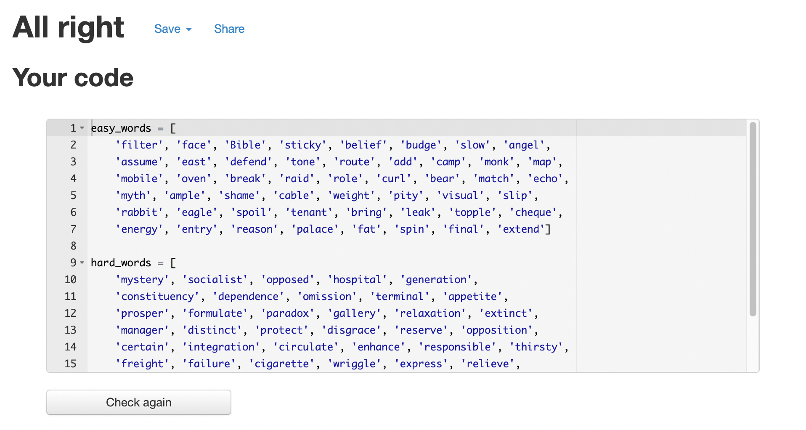

I fixed all errors for the slides.py file however there are still warnings which are all due to trailing whitespace in the file.
This whitespace is required for the tornado and house image to display properly in the terminal. Without the tornado display the game will not work on a visual level for the user and the file contains no code in regards to the running/logic of the game, so I decided that I had to leave this as is with the warnings:

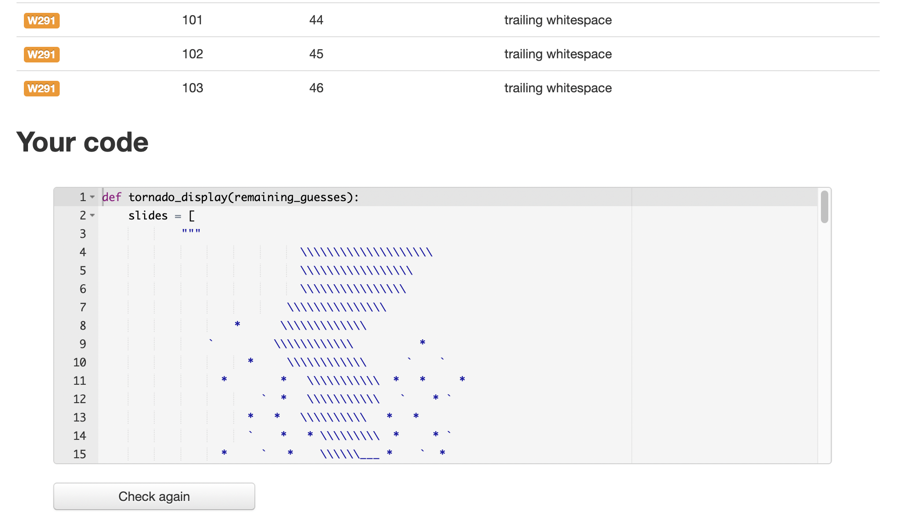

### Function Testing

As the game runs in the terminal (or via the Heroku app) there was no need to test on multiple devices/browsers
as it will run the same on all of them. Testing was done on my MacBook Air and the process references all the features mentioned in the previous functionality section. The process was as follows:

- Test that the 'home page' displays the logo and rules and difficulty input (with typing effects) properly
- Test that the user input for difficulty responds as expected; hard = hard words, easy = easy words, quit = quit game
- Test that the game displays as expected once starting; reveal word is empty, remaining guesses = 5, already guessed is empty and the tornado image is at it's intended starting position
- Test that both word and letter input validation works so that anything which isn't alphabetical will give the user invalid input feedback
- Test that correct letter guesses result in correct letter feedback & the letter displaying in reveal word and guessed letters
- Test that incorrect letter guesses result in incorrect letter feedback, remaining guesses decreases by 1, the tornado image moves closer to the house and the letter is added to guessed letters
- Test that correct word guesses result in win game feedback being displayed to the user and that the play again option is displayed
- Test that incorrect word guesses result in incorrect word feedback, remaining guesses decreases by 1 and the tornado image moves closer to the house
- Test that when the user reaches 0 guesses the tornado hits the house and the game ends, the user is told what the correct word was and is asked if they want to play again
- Test that if the user choses to play again they are taken to the play again page and that the choose difficulty input works as expected
- Test that if the user choses not to play again they are taken to the quit game page
- Test that the quit game function works at any point in the game and that the user is displayed the quit game page

## Fixes

I had two issues to fix with my code.

The first was that in the while loop of the run game function the wingame function would be called properly and displayed to the user, however the while loop would not break and so the game would ask the user to make a guess even though the game had already been won or lost. To fix this I added the following code:

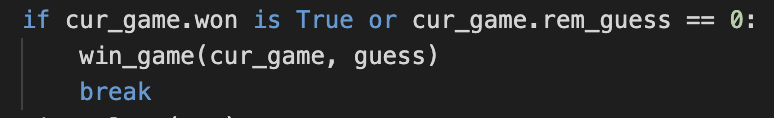

The next issue was that the f string in the win game function displayed "{guess} is correct, well done you saved the household!" when the user won - the issue was if the user guessed the word letter by letter it would display the winning word as an individual letter. The following code was used to fix this:

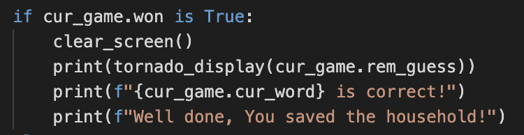

## Outstanding Bugs

To my knowledge there are no outstanding bugs in the game.

## Libraries

The game made use of the following libraries:

- random - to allow a word to be chosen at random from the words.py file for the game
- os - to allow the terminal to clear when called (as this is specific to the operating system terminal I do not believe it works as intended in the Heroku app however I decided to leave it in for compatibility with a computer terminal)
- time - to allow a delay between the update of display to the user, meaning the user has more chance to read feedback
- sys - to allow the t_print and t_input functions to work properly; print text with a typing effect

## Future Development

With the use of the Tornado class which runs the game it allows plenty of scope for future development as you can add further instance variables to the game. 

Potential features to implement: 

- A score feature so when a user carries on playing they can build on their score
- More word lists so you can have different categories/difficulties for the user to chose
- More personalisation of the game so the user can input their name and then save their game and come back to it

## Deployment

- Sign up for an account with Heroku
- Create a new app whilst logged into Heroku
- Set buildpacks to 'Python' & 'NodeJS'
- Link Heroku app to the GitHub repository
- Deploy to Heroku

Live link: https://python-hangman1.herokuapp.com/

## Credits

- The code for the t_print and t_input functions for the games text typing effect were from [101computing.net](https://www.101computing.net/python-typing-text-effect/)
- The code for the update_reveal_word function, along with general inspiration was taken from the YouTube video by [Kite](https://www.youtube.com/watch?v=m4nEnsavl6w&t=434s)

## Media

-  The tornado displays were taken from [ascii.co.uk](https://ascii.co.uk)
-  The game logo was made using [patorjk.com](https://patorjk.com) 